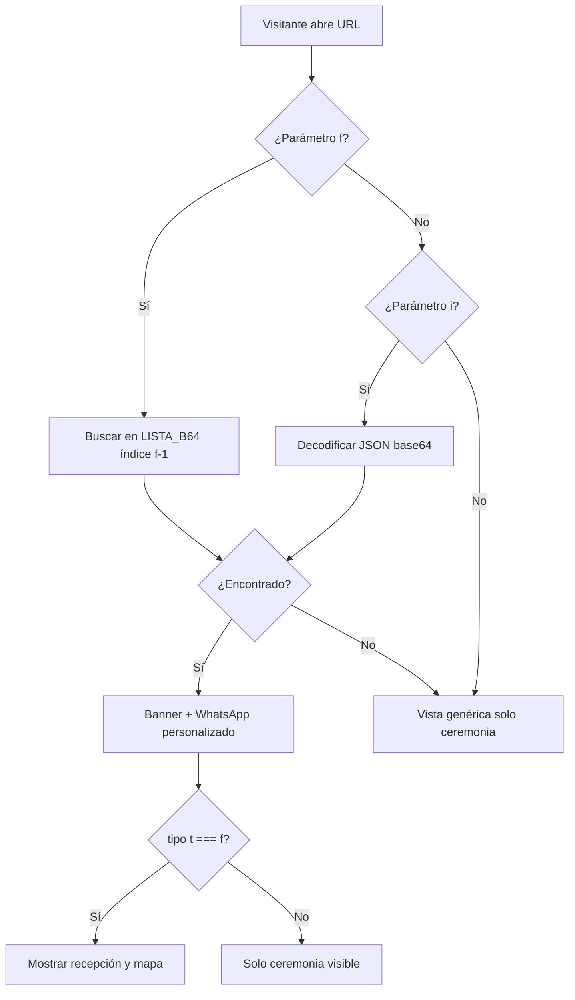

# Personalización de invitaciones

## Resumen del flujo



## Parámetro `?f=N` (códigos cortos)

La lista de invitados está codificada en la constante `LISTA_B64` dentro de `index.html`. Cada entrada es un arreglo:

```json
["Nombre de la familia", puestos, niños]
```

| Campo | Tipo | Descripción |
|-------|------|-------------|
| Nombre | string | Texto del banner «Invitación especial para» |
| Puestos | number | Cupos reservados (aparece en el banner) |
| Niños | number | Niños incluidos en el cupo (0 = no mostrar) |

El parámetro `f` es **1-based**: `?f=1` es la primera familia, `?f=79` la última.

El script asigna automáticamente `t: "f"` (familia/lista), lo que activa las secciones `.solo-familia`.

## Parámetro `?i=...` (manual)

Alternativa para invitados puntuales sin estar en la lista numerada.

### Estructura del JSON

```json
{
  "n": "María García",
  "p": 2,
  "k": 0,
  "t": "f"
}
```

| Campo | Descripción |
|-------|-------------|
| `n` | Nombre mostrado en el banner |
| `p` | Número de puestos (opcional; solo se muestra si `t` es `"f"`) |
| `k` | Niños incluidos (opcional) |
| `t` | `"f"` = familia (ceremonia + recepción + mapa), `"a"` = amigos (solo ceremonia) |

### Codificación

1. Serializar el JSON (sin espacios innecesarios).
2. Codificar en base64.
3. Sustituir `+` → `-`, `/` → `_` y quitar `=` finales (base64 URL-safe).

Ejemplo en Node.js:

```javascript
function codificarInvitado(datos) {
  return Buffer.from(JSON.stringify(datos), "utf8")
    .toString("base64")
    .replace(/\+/g, "-")
    .replace(/\//g, "_")
    .replace(/=+$/, "");
}

// Amigo, solo ceremonia
codificarInvitado({ n: "Carlos López", p: 1, k: 0, t: "a" });
// → eyJuIjoiQ2FybG9zIETDs3BleiIsInAiOjEsImsiOjAsInQiOiJhIn0
```

URL resultante:

```
https://davanegasa.github.io/boda-andy-danny/?i=eyJuIjoiQ2FybG9zIETDs3BleiIsInAiOjEsImsiOjAsInQiOiJhIn0
```

## WhatsApp personalizado

Si hay datos de invitado válidos, todos los enlaces `wa.me` se reemplazan con un mensaje como:

- Un puesto: *«Soy [nombre] y confirmo mi asistencia…»*
- Varios: *«Somos [nombre] y confirmamos nuestra asistencia (N personas)…»*

Sin personalización, el mensaje genérico es: *«¡Hola! Confirmo mi asistencia a la boda de Andrés Mauricio y Karen Daniela 🤍»*

## Editar la lista de invitados

1. Decodificar `LISTA_B64` actual (ver script abajo).
2. Modificar el arreglo JSON: agregar, quitar o editar filas `[nombre, puestos, niños]`.
3. Volver a codificar en base64 estándar y pegar en `const LISTA_B64 = "..."`.
4. Ejecutar `node scripts/generar-enlaces.mjs` para actualizar [ENLACES-INVITADOS.md](ENLACES-INVITADOS.md), [ENLACES-INVITADOS.csv](ENLACES-INVITADOS.csv) y la página [../enlaces/](../enlaces/).

```javascript
// Decodificar lista actual
function b64d(s) {
  s = s.replace(/-/g, "+").replace(/_/g, "/");
  while (s.length % 4) s += "=";
  return Buffer.from(s, "base64").toString("utf8");
}

// Codificar lista nueva
function b64e(arr) {
  return Buffer.from(JSON.stringify(arr), "utf8").toString("base64");
}
```

**Importante:** el orden del arreglo define el número `f`. Si insertas una fila al inicio, todos los enlaces `?f=N` posteriores cambian de destinatario.

## Prioridad de parámetros

1. `?f=` — se evalúa primero.
2. `?i=` — solo si `f` no produjo datos válidos.
3. Sin parámetros — vista genérica.

Ambos parámetros no se combinan; `f` tiene prioridad.

## Secciones condicionadas

Elementos con clase CSS `solo-familia` (ocultos por defecto):

- Tarjeta de **Recepción** (dirección, hora, enlace a Maps).
- Tarjeta con **mapa esquemático** iglesia → recepción.

Se muestran con `display: flex` cuando `datos.t === "f"`.
